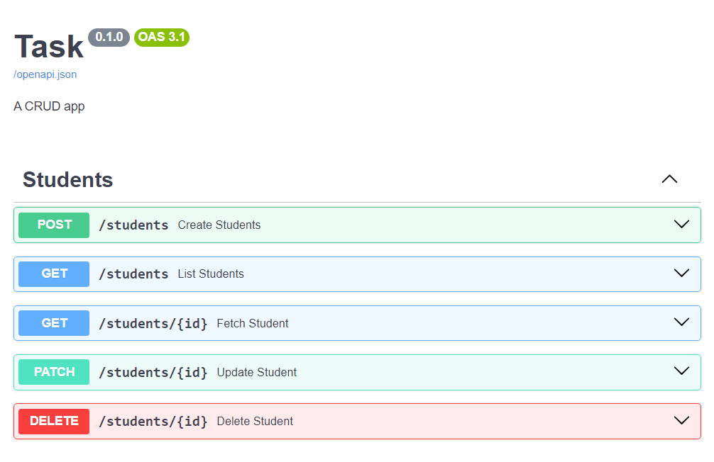

# Library Management System
Library Management System is a FastAPI CRUD application with MongoDB as database.

# API


## Running Locally 

### Setting up the project 
Clone the repository and navigate to its directory
Create and activate virtual environment
```bash
pythom -m venv .
./Scripts/activate
```
### Install requirements
Install requirements with
```bash
pip install -r requirements.txt
```

### Setting up environment variables
Create .env file
Populate the ```DATABASE_URL``` field with MongoDB connection string. (see .example.env)

### Run
```bash 
uvicorn main:app --reaload
```